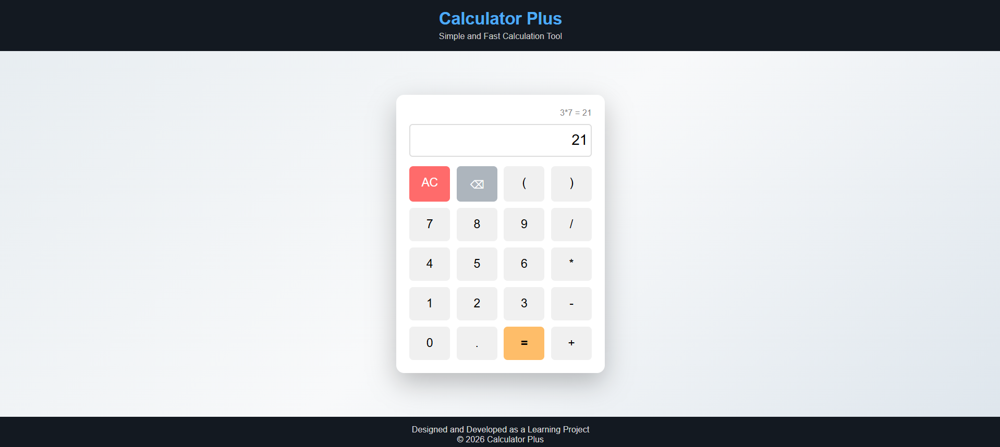

# Calculator Plus

A clean and responsive calculator built using HTML, CSS, and JavaScript.
This project evaluates mathematical expressions with proper operator precedence and error handling.

---

## 🚀 Features

* Basic arithmetic operations (+, -, *, /)
* Supports parentheses for complex expressions
* Handles operator precedence correctly
* Input validation and error handling
* Backspace and clear functionality
* Calculation history display
* Simple and user-friendly interface

---

## 🛠️ Tech Stack

* HTML5
* CSS3
* JavaScript (Vanilla)

---

## 📸 Screenshot

---

## 📂 Project Structure

calculator-plus/
│── index.html
│── style.css
│── script.js
│── calculator.png
│── README.md

---

## 👩‍💻 Author

Chanchal Kumari
